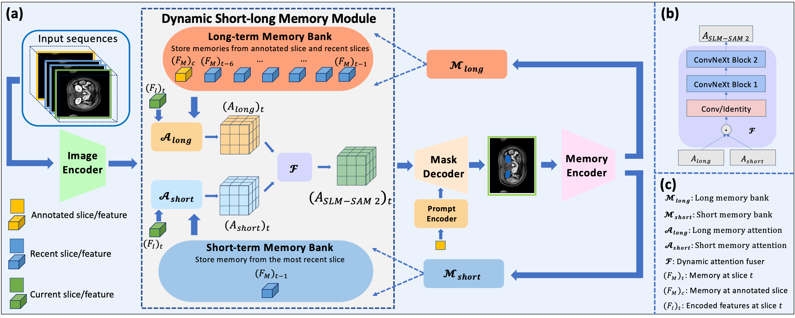

# SLM-SAM2: Accelerating Volumetric Medical Image Annotation via Short-Long Memory SAM 2
This is the official implementation of SLM-SAM 2.

[]()

#### By [Yuwen Chen](https://scholar.google.com/citations?user=61s49p0AAAAJ&hl=en)



SLM-SAM 2 is a novel video object segmentation method that can accelerate volumetric medical image annotation by propagating annotations from a single slice to the remaining slices within volumes. By introducing a dynamic short-long memory module, SLM-SAM 2 shows improved segmentation performance on organs, bones and muscles across different imaging modalities than SAM 2.


## Installation
Firstly, please install PyTorch and TorchVision dependencies following instructions [here](https://pytorch.org/get-started/locally/). SLM-SAM 2 can be installed using:
```bash
cd SLM-SAM 2

pip install -e .
```

## Getting Started

### 1. Download SAM 2 Pretrained Checkpoints
Before finetuning, we need to download SAM 2 pretrained checkpoints using following commands:
```bash
cd  checkpoints && \
./download_ckpts.sh && \
cd ..
```

### 2. Finetuning on Medical Dataset
Open ```./sam2/configs/sam2.1_training/slm_sam2_hiera_t_finetune.yaml```, add path to image folder, mask folder, and text file describing volumes used for training. The dataset format follows the same as that of SAM 2.

```
DATA_DIRECTORY
├── images
│   ├── volume1
│   │   ├── 00000.jpg
│   │   ├── 00001.jpg
│   │   └── ...
│   └── ...
├── masks
│   ├── volume1
│   │   ├── 00000.png
│   │   ├── 00001.png
│   │   └── ...
│   └── ...
├── train.txt
├── test.txt
```

Start finetuning by using:

```
CUDA_VISIBLE_DEVICES=[GPU_ID] python3 training/train.py \
    -c configs/sam2.1_training/slm_sam2_hiera_t_finetune.yaml \
    --use-cluster 0 \
    --num-gpus 1
```

### 3. Inference


